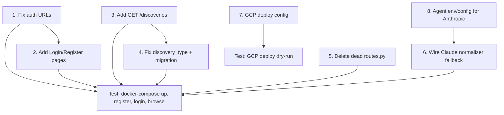

# Plan: Get NetDiscoverIT Testable & GCP-Ready (Phase 2)

## Context

The app has substantial backend (FastAPI + PostgreSQL + Neo4j + pgvector) and frontend (React + Chakra UI) code, but several gaps prevent end-to-end testing. The refactored routes package (`app/api/routes/`) is live, while the old monolithic `routes.py` is dead code. Auth, CRUD, NLI, compliance reports, change management, topology, and alerting routes are largely implemented. The main blockers are: missing frontend auth flow (no login/register pages), broken API URL prefixes in the frontend, a missing `GET /discoveries` list endpoint, a `discovery_type` model column gap, dead code, and the lack of any GCP deployment configuration.

For the Ollama dependency (agent-side normalizer + vectorizer), we'll wire Claude API as an alternative for testing.

---

## Work Items

### 1. Fix Frontend Auth URLs (Bug — blocks all API calls)

**File:** `services/frontend/src/services/api.js`

The `login()`, `register()`, and `refreshToken()` methods call `/auth/*` but the server mounts at `/api/v1/auth/*`.

| Method | Current | Fix |
|---|---|---|
| `login()` L107 | `${this.baseUrl}/auth/login` | `${this.baseUrl}/api/v1/auth/login` |
| `register()` L124 | `${this.baseUrl}/auth/register` | `${this.baseUrl}/api/v1/auth/register` |
| `refreshToken()` L88 | `${this.baseUrl}/auth/refresh` | `${this.baseUrl}/api/v1/auth/refresh` |

---

### 2. Add Login & Register Pages (Frontend — blocks user testing)

Create `services/frontend/src/pages/Login.jsx` and `services/frontend/src/pages/Register.jsx`.

- Simple Chakra UI form pages (email + password, submit button, link to register/login)
- Wire into `AuthContext` (already has `login()` and `register()` methods)
- Add routes in `App.js`: `/login` and `/register`
- Add `ProtectedRoute` wrapper that redirects unauthenticated users to `/login`
- Wrap existing routes in `ProtectedRoute`

---

### 3. Add `GET /discoveries` List Endpoint (Missing route)

**File:** `services/api/app/api/routes/discoveries.py`

Add a `GET ""` endpoint that lists discoveries for the user's org (mirroring the pattern in `devices.py`). The frontend `api.getDiscoveries()` calls `GET /api/v1/discoveries`.

---

### 4. Fix `discovery_type` Model Column (Schema mismatch)

**File:** `services/api/app/models/models.py` — `Discovery` class

Add `discovery_type = Column(String(50), default="full")` to the Discovery model. The routes and schemas already reference it.

**Migration:** Create an Alembic migration to add the column.

---

### 5. Delete Dead `routes.py` Monolith

**File:** `services/api/app/api/routes.py` (114KB dead code)

Python's package resolution means `app/api/routes/` (package with `__init__.py`) takes priority over `app/api/routes.py`. The flat file is never imported. Delete it.

---

### 6. Wire Claude API as Normalizer Fallback for Testing

**File:** `services/agent/agent/normalizer.py`

The normalizer already has an `_normalize_anthropic()` method. Ensure it works without Ollama by:
- Confirming `ANTHROPIC_API_KEY` is read from the agent config
- Making the fallback chain robust: TextFSM -> Anthropic -> rule-based (skip Ollama/Gemini when not configured)

**File:** `services/agent/agent/config.py` — add `ANTHROPIC_API_KEY` and `ANTHROPIC_MODEL` if not present.

---

### 7. GCP Deployment Configuration

Create the following files for GCP Cloud Run deployment:

```
deploy/
  gcp/
    cloudbuild.yaml           # Cloud Build pipeline (build + push + deploy)
    api.Dockerfile            # Prod API Dockerfile (non-dev, no --reload)
    frontend.Dockerfile       # Prod frontend (multi-stage nginx build)
    cloud-run-api.yaml        # Cloud Run service spec for API
    cloud-run-agent.yaml      # Cloud Run Job spec for agent (on-demand)
    env.template.yaml         # Mapping of env vars to Secret Manager refs
```

Key GCP decisions:
- **API:** Cloud Run service (auto-scaling, managed TLS)
- **Frontend:** Cloud Run serving static nginx build, or Cloud Storage + CDN (simpler); start with Cloud Run for parity
- **PostgreSQL:** Cloud SQL for PostgreSQL (with pgvector extension enabled)
- **Neo4j:** Neo4j AuraDB Free tier for testing, or self-managed on GCE for prod
- **Redis:** Memorystore for Redis
- **Object Storage:** GCS replacing MinIO (boto3 is S3-compatible; add GCS endpoint config)
- **Secrets:** GCP Secret Manager (replace `.env` file approach)

The `cloudbuild.yaml` will:
1. Build API and Frontend images
2. Push to Artifact Registry
3. Deploy to Cloud Run
4. Run Alembic migrations as a Cloud Build step

---

### 8. Add `ANTHROPIC_API_KEY` to `.env.example` and Agent Config

Ensure the `.env.example` already has `ANTHROPIC_API_KEY=` (it does). Verify the agent's `docker-compose` environment passes it through, and that the agent config reads it.

---

### 9. Add `config_hash` Column Handling in Agent Upload

**File:** `services/api/app/api/routes/agents.py` — the upload endpoint already handles `config_hash`. Verify the schema `AgentDeviceUpload` includes it.

---

## Execution Order



Items 1-6 can be parallelized. Item 7 (GCP config) is independent.

---

## Verification

1. `make up-build` — all services start without errors
2. Register a user via the new frontend register page
3. Login and see the dashboard load (portal/overview returns data)
4. Navigate to Devices, Discoveries, Topology, Changes, Compliance, Assistant pages — no 404s or console errors
5. `make test` — existing tests pass
6. `make lint` — no new lint errors
7. Review `deploy/gcp/` files for completeness