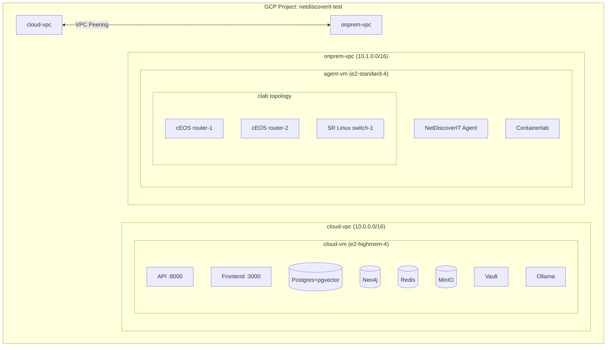

# GCP Deployment for End-to-End Testing

## Context

NetDiscoverIT runs entirely via Docker Compose locally. To validate the two-tier architecture (on-prem agent + cloud platform) under realistic conditions, we need to deploy to GCP with network separation that mirrors a real customer deployment. Containerlab will simulate network devices (routers, switches) so the agent has real SSH/SNMP targets to discover.

## Architecture



**Why two VPCs instead of one?** This validates the real deployment model — the agent must reach the API over a routed network (not localhost), and the cloud services must never have direct access to the Containerlab devices. VPC peering simulates a VPN/WAN link.

**Why Compute Engine instead of GKE?** Fastest path to testing. The docker-compose.yml works as-is on a VM. Containerlab also requires Docker socket access and privileged containers, which is simpler on a VM than on GKE. GKE migration can come later for production.

## Deliverables

### 1. Terraform infrastructure (`infra/gcp/`)

| File | Purpose |
|------|---------|
| `infra/gcp/main.tf` | Provider, project, region |
| `infra/gcp/network.tf` | Two VPCs, subnets, VPC peering, firewall rules |
| `infra/gcp/compute.tf` | Two VMs (cloud + agent), startup scripts |
| `infra/gcp/variables.tf` | Project ID, region, machine types, SSH key |
| `infra/gcp/outputs.tf` | VM IPs, SSH commands |
| `infra/gcp/firewall.tf` | Ingress rules (443/80 to cloud, agent→API on 8000, SSH 22 for admin) |

**Key Terraform resources:**

```
google_compute_network        x2  (cloud-vpc, onprem-vpc)
google_compute_subnetwork     x2
google_compute_network_peering x2  (bidirectional)
google_compute_firewall       x4  (cloud-ingress, agent-to-api, ssh-admin, iap-ssh)
google_compute_instance       x2  (cloud-vm, agent-vm)
```

**Firewall rules:**
- `cloud-ingress`: Allow 80, 443, 8000 from 0.0.0.0/0 to cloud-vm (testing only — lock down later)
- `agent-to-api`: Allow 8000 from onprem-vpc subnet to cloud-vm
- `ssh-admin`: Allow 22 from IAP range (35.235.240.0/20) to both VMs
- `internal-clab`: Allow all traffic within onprem-vpc (Containerlab needs this)

### 2. Cloud VM startup script (`infra/gcp/scripts/cloud-startup.sh`)

Runs on first boot:
1. Install Docker + Docker Compose
2. Clone the repo (or pull images from GHCR)
3. Generate `.env` from GCP Secret Manager (or a template with sane test defaults)
4. Override `API_ENDPOINT` and `CORS_ORIGINS` with the cloud VM's external IP
5. Run `docker compose up -d` (excluding the `agent` service)
6. Verify health: `curl localhost:8000/api/v1/health`

### 3. Agent VM startup script (`infra/gcp/scripts/agent-startup.sh`)

Runs on first boot:
1. Install Docker + Docker Compose
2. Install Containerlab (`bash -c "$(curl -sL https://get.containerlab.dev)"`)
3. Pull Containerlab node images (SR Linux is free, cEOS requires Arista account)
4. Clone the repo
5. Deploy Containerlab topology (see below)
6. Configure agent `.env` with `API_ENDPOINT=http://<cloud-vm-internal-ip>:8000`
7. Start agent container

### 4. Containerlab topology (`infra/gcp/clab/topology.yml`)

A small but realistic test network the agent can discover:

```yaml
name: netdiscoverit-test-lab
topology:
  nodes:
    spine1:
      kind: nokia_srlinux
      image: ghcr.io/nokia/srlinux:24.10.1
    spine2:
      kind: nokia_srlinux
      image: ghcr.io/nokia/srlinux:24.10.1
    leaf1:
      kind: nokia_srlinux
      image: ghcr.io/nokia/srlinux:24.10.1
    leaf2:
      kind: nokia_srlinux
      image: ghcr.io/nokia/srlinux:24.10.1
    server1:
      kind: linux
      image: alpine:latest
  links:
    - endpoints: [spine1:e1-1, leaf1:e1-49]
    - endpoints: [spine1:e1-2, leaf2:e1-49]
    - endpoints: [spine2:e1-1, leaf1:e1-50]
    - endpoints: [spine2:e1-2, leaf2:e1-50]
    - endpoints: [leaf1:e1-1, server1:eth1]
```

Nokia SR Linux is free (no license needed) and supports SSH + SNMP out of the box — ideal for testing the agent's collector and normalizer. The spine-leaf topology exercises topology discovery (LLDP neighbors) and gives the agent multiple devices to scan.

**Why SR Linux over cEOS?** SR Linux images are freely available from GHCR. Arista cEOS requires a download from arista.com with an account. For automated VM provisioning, SR Linux is simpler. We can add cEOS later for multi-vendor testing.

### 5. Agent config for Containerlab devices (`infra/gcp/clab/agent-config.yaml`)

Override of `configs/agent.yaml` with Containerlab device IPs:

```yaml
API_ENDPOINT: "http://<cloud-vm-internal-ip>:8000"
DISCOVERY_METHODS: [ssh, snmp, lldp]
devices:
  - hostname: spine1
    ip: <clab-spine1-mgmt-ip>
    type: router
    vendor: nokia
    methods: [ssh]
    credentials:
      username: admin
      password: NokiaSrl1!
  # ... repeat for spine2, leaf1, leaf2
```

Containerlab assigns management IPs from a Docker bridge. The startup script will extract IPs with `containerlab inspect` and template them into the agent config.

### 6. Makefile targets

Add to existing `Makefile`:

```makefile
# GCP test environment
gcp-init:
    cd infra/gcp && terraform init

gcp-up:
    cd infra/gcp && terraform apply -auto-approve

gcp-down:
    cd infra/gcp && terraform destroy -auto-approve

gcp-ssh-cloud:
    gcloud compute ssh cloud-vm --zone=$(GCP_ZONE) --tunnel-through-iap

gcp-ssh-agent:
    gcloud compute ssh agent-vm --zone=$(GCP_ZONE) --tunnel-through-iap

gcp-status:
    cd infra/gcp && terraform output
```

## Implementation Order

1. **Terraform infra** (`network.tf`, `compute.tf`, `firewall.tf`, `variables.tf`, `outputs.tf`, `main.tf`)
2. **Cloud VM startup script** — get API + frontend running on the cloud VM
3. **Containerlab topology** — define the test network
4. **Agent VM startup script** — install Containerlab, deploy topology, start agent
5. **Agent config template** — wire agent to Containerlab devices + cloud API
6. **Makefile targets** — convenience commands
7. **Update CD workflow** — optionally add a `deploy-test` job that runs `terraform apply`

## Verification

1. `terraform apply` completes without errors
2. SSH into cloud-vm → `curl localhost:8000/api/v1/health` returns 200
3. SSH into agent-vm → `containerlab inspect -t /opt/clab/topology.yml` shows running nodes
4. SSH into agent-vm → `ssh admin@<spine1-ip>` connects to SR Linux
5. Agent container logs show successful discovery cycle: collector → normalizer → sanitizer → vectorizer → uploader
6. Cloud API shows discovered devices: `curl <cloud-vm-ip>:8000/api/v1/devices`
7. Frontend at `<cloud-vm-ip>:3000` displays topology graph from Neo4j

## Cost Estimate

- cloud-vm (e2-highmem-4) + agent-vm (e2-standard-4): ~$0.40/hr total (~$9.60/day)
- Use `gcp-down` to destroy when not testing
- Preemptible/spot VMs can cut cost by 60-80% if interruptions are acceptable

## Not in scope (future)

- TLS/HTTPS (covered by existing TLS/mTLS design doc)
- GKE migration for production
- Cloud SQL / Memorystore managed services
- Multi-vendor Containerlab (cEOS, Juniper vJunos) — can add later
- CI/CD auto-deploy to GCP on merge     